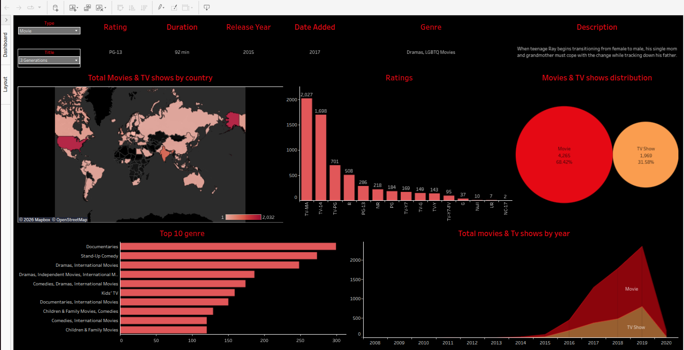

# 📊 Netflix

This is a project where I mostly concentrated on Visualizing the right, getting the right Metrics that align with the stakeholder's requirements 
and also keeping the visualizations very simple to understand and the dashboard very easy to use.
---

##  Data Sources

Credit to **DataScience RoadMap/DataScienceRoadMapDSRMAdd** youtube channel/ github.
https://github.com/DataScienceRoadMapDSRM/Tableau-Dashboards-info/blob/main/netflix_titles.csv


---

## Link to the Tableau and Linkedin Post

**Tableau:** https://public.tableau.com/app/profile/ochwo.edrian.jude/viz/NetflixTitles_17746148649870/Netflix
**Linkedin Post:**

## Project Overview

The project includes interactive analyses and visualizations:

- **Total Movies & TV shows by country:** A map showing the number of shows or movies watched on Netflix by country in the world.
- **Ratings:** A bar graph the ratings for different shows and Movies.
. **Top 10 genre:** Horizontal bar chart showing top 10 watched Genres.
- **Movie & Tv shows distribution** A bubble chart comparing the distribution between Movies and TV shows on Netflix(Total, Percentage).
- **Total Movies and TV Shows:** A line(Area) graph showing the Total TV shows and movies by Chart.

### Dashboard Outlook.

  

---

##  Technologies Used

- **Data Analysis & Visualization:** Tableau and Excel.

---

## 📁 Folder Structure
```
.
├── images/
│   └── dashboard.png
├── netflix_titles.csv
├── README.md
```

---

## How to Access

Check out the dashboard on my tableau account link below.

https://public.tableau.com/app/profile/ochwo.edrian.jude/viz/NetflixTitles_17746148649870/Netflix
---


